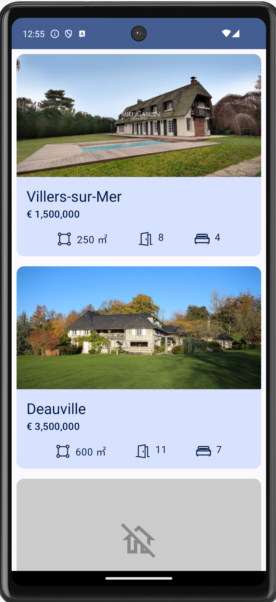
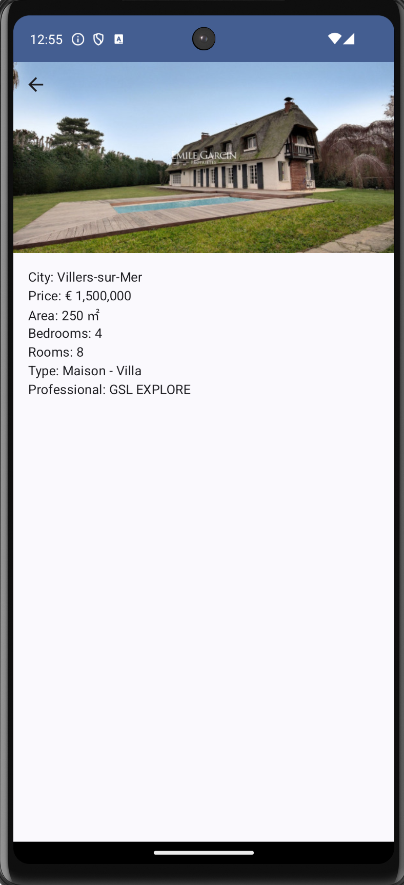

# RealEstateApp TestAssignment

## Technologies

- Jetpack Compose
- Coil
- Hilt
- Retrofit
- KotlinX Serialization
- Kotlin Coroutines
- Jupiter
- Mockk

## Architecture

Implemented a clean architecture, with separation between Domain, Data, and UI layers.
A repository pattern was chosen to separate data sources, with the potential to add local data storage.
All data provided by use cases.
UI layer implemented with MVVM pattern. ViewModel shares data to UI only through observer pattern (SharedFlow and StateFlow)

## Testing

Covered successful data receiving on a list screen.

## Improvements

### UI
Add empty states (Loading, Error, Normal are implemented)
Add transition animations
Add debounce for button clicks

### DATA
Implement local storage
Improve data usage (OfferType is omitted from UI as an unknown type)

### TESTS

Cover with tests: view models, use cases, repository, and data source. 